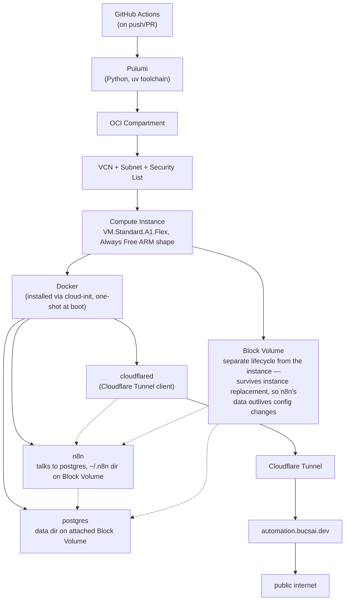

# n8n on OCI — GitOps Deployment

A GitOps-managed deployment of [n8n](https://n8n.io/) (workflow automation tool) on Oracle Cloud Infrastructure's Always Free tier, provisioned entirely through Infrastructure as Code and continuous deployment.

## Project Goals

- Provision a free-tier OCI Ampere (ARM) compute instance using Pulumi
- Deploy and run n8n on that instance via cloud-init, treating the instance as immutable — no inbound access, no ad hoc changes; config updates mean replacing the instance, not logging into it
- Expose n8n securely to the public internet through a Cloudflare Tunnel, mapped to a custom `.dev` domain — no open inbound ports on the VM at all, including SSH
- Drive all provisioning and configuration changes through a GitHub Actions pipeline, so infrastructure changes are triggered by commits/PRs rather than manual `pulumi up` runs
- Keep all infrastructure state, configuration, and history versioned in this repository (GitOps model)

## Architecture (planned)



## Tech Stack

| Layer | Choice |
|---|---|
| IaC | [Pulumi](https://www.pulumi.com/) (Python, `pulumi-oci` provider) |
| Package/venv management | [uv](https://docs.astral.sh/uv/) |
| Cloud provider | Oracle Cloud Infrastructure (OCI), Always Free tier |
| Compute | ARM Ampere `VM.Standard.A1.Flex` instance |
| Application | [n8n](https://n8n.io/) (self-hosted, Dockerized) |
| Database | PostgreSQL (Dockerized, data on a dedicated OCI Block Volume) |
| Ingress / exposure | Cloudflare Tunnel (`cloudflared`) |
| DNS | Custom `.dev` domain via Cloudflare |
| CI/CD | GitHub Actions |

## Why these choices

- **OCI Always Free ARM tier**: provides a genuinely free, always-on VM (up to 4 OCPUs / 24GB RAM across Ampere A1 instances), which is more generous than most free tiers and well suited to running a lightweight workflow engine like n8n.
- **Cloudflare Tunnel**: avoids exposing the VM's public IP or opening inbound firewall ports — the tunnel makes an outbound-only connection from the VM to Cloudflare's edge, which terminates TLS and routes traffic to the custom domain.
- **Pulumi over Terraform + Ansible**: the original plan was Terraform for provisioning paired with Ansible for configuration management. Given the scope of this project (a single VM running one application), that split added more moving parts than it was worth. Pulumi covers both provisioning and, via its Python program, enough configuration logic (e.g. cloud-init) to avoid needing a separate config management tool — one language, one tool, one state model.
- **Immutable instance, no SSH**: the instance has no inbound security list rules at all — not even SSH. All setup happens once via cloud-init at boot; a config change means replacing the instance through Pulumi, not connecting to fix it in place. This follows the "cattle, not pets" principle and keeps the actual running state from drifting away from what's declared in Git, which matters more once this is public-facing and accepting logins. Emergency debugging (if ever needed) goes through OCI's Instance Console Connection, which doesn't touch the VCN or require any open port.
- **GitHub Actions as the deployment trigger**: every infrastructure or configuration change goes through version control and a pipeline run, rather than being applied ad hoc from a local machine — the core GitOps principle this project demonstrates.
- **PostgreSQL on a dedicated Block Volume, not local SQLite**: n8n defaults to a local SQLite file for its workflows/credentials, which would be lost every time the instance is replaced. Postgres runs as its own container with its data directory on a separate OCI Block Volume — a resource with its own lifecycle, independent of the compute instance. Replacing the instance (a config change) never touches this volume, so the data survives. (OCI's free-tier "Autonomous Database" was considered first, but it's Oracle's own database engine, not Postgres-compatible, and isn't usable with n8n.) The volume is attached at instance *launch time* rather than as a separate post-launch step, so it's already present when cloud-init runs on first boot — avoiding a race between cloud-init and a later attachment call.

## Status

🚧 In progress — networking, compute, the Docker/Postgres/n8n stack, and Cloudflare Tunnel + DNS routing are provisioned via Pulumi. A GitHub Actions pipeline runs `pulumi preview` on PRs and `pulumi up` on push to `main`; it still needs the `PULUMI_ACCESS_TOKEN` repository secret set before it can run (see Prerequisites).

## Roadmap

- [x] Define OCI networking (VCN, subnet, security list) via Pulumi
- [x] Provision the ARM compute instance
- [x] Automate Docker + n8n installation on the instance via cloud-init
- [x] Set up Cloudflare Tunnel and DNS routing to `automation.bucsai.dev`
- [x] Provision the n8n owner account and license activation via Pulumi config
- [x] Configure Pulumi remote state backend (Pulumi Cloud, via `pulumi login`)
- [x] Build GitHub Actions workflow for `pulumi preview`/`pulumi up` on push/PR
- [x] Document secrets/config management (OCI API keys, Cloudflare API token)

## Known Limitations / Follow-ups

- **`n8nio/n8n:latest` is unpinned.** Every instance replacement pulls whatever is current at that moment, which is non-reproducible and can introduce breaking changes silently. Should be pinned to a specific version tag once the stack is stable enough that upgrades can be deliberate, versioned changes in `__main__.py` instead.
- **All three container images (`postgres`, `n8n`, `cloudflared`) are pulled fresh on every instance replacement.** Only `/mnt/n8n-data` (Postgres data, n8n's `~/.n8n`) survives on the persistent Block Volume — the boot disk, and with it Docker's image cache, is thrown away with the old instance. Expect every config change / redeploy to take a few minutes for image pulls before n8n is reachable again, worse on Always Free's throttled NAT egress. Pinning versions (above) would at least make pulls reproducible, not faster.
- **The documented "emergency debugging via Instance Console Connection" doesn't work as described.** A Console Connection only authenticates the tunnel to OCI's serial console proxy — the `<instance> login:` prompt still needs a real OS credential, and none is configured (no SSH key, no password), by design. Console history capture is also not useful for this: Ubuntu's ARM cloud image doesn't mirror cloud-init/docker output to the serial console, so the captured buffer only has early kernel boot messages. In practice, diagnosing a boot-time failure currently means temporarily adding a `chpasswd` block to `CLOUD_INIT_TEMPLATE` in `__main__.py`, redeploying, and removing it again afterward — not a real fix, just what worked when n8n's container hit a bind-mount permission error (see the `chown` step in `runcmd`) and needed live `docker compose logs` to diagnose.
- **Instance sized at 2 OCPU / 12GB**, half of the Always Free ARM allowance (4 OCPU / 24GB total) — deliberate headroom, not a constraint. Adjustable via `shape_config` in `__main__.py` if n8n needs more.

## Prerequisites

Before running anything in this repo, the following need to be in place:

- **OCI account** with the Always Free tier available in your home region (Ampere A1 capacity isn't guaranteed in every region — worth checking availability first).
- **OCI API key configured for Pulumi**, either as a local `~/.oci/config` file or as equivalent Pulumi OCI provider config values. You'll need, from the OCI Console (Identity → Users → your user → API Keys):
  - Tenancy OCID
  - User OCID
  - Region
  - An API signing key pair, with the public key uploaded to your OCI user and the fingerprint noted
- **Pulumi CLI** installed, and a [Pulumi Cloud](https://app.pulumi.com/) account for the state backend (free for individual use). Run `pulumi login` once locally.
- **Two application secrets** set via Pulumi config before applying the stack:
  ```bash
  pulumi config set --secret postgres:password "$(openssl rand -hex 24)"
  pulumi config set --secret n8n:encryptionKey "$(openssl rand -hex 32)"
  ```
  `n8n:encryptionKey` in particular must stay fixed across instance replacements — n8n uses it to encrypt stored credentials, so changing it makes existing credentials unreadable.
- **uv** installed for Python dependency/toolchain management (`uv sync` sets up the venv used by Pulumi).
- **Cloudflare account** with `bucsai.dev` added as a zone, plus a Cloudflare API token scoped for `Account.Cloudflare Tunnel:Edit` and `Zone.DNS:Edit` on that zone. Set the following Pulumi config before applying the stack:
  ```bash
  pulumi config set --secret cloudflare:apiToken "<token>"
  pulumi config set --secret cloudflare:accountId "<account id, from the Cloudflare dashboard URL or API>"
  pulumi config set --secret cloudflare:zoneId "<zone id for bucsai.dev, from the domain overview page>"
  ```
  `n8n:hostname` defaults to `automation.bucsai.dev`; override with `pulumi config set n8n:hostname <hostname>` if needed.
- **n8n owner account details** — provisioned via n8n's native `N8N_INSTANCE_OWNER_MANAGED_BY_ENV` mechanism (n8n >= 2.17.0), which creates the account at n8n's own startup, before it ever serves a request — so the public "Set up owner account" screen never appears on the live domain:
  ```bash
  pulumi config set --secret n8n:ownerEmail "you@example.com"
  pulumi config set n8n:ownerFirstName "Your First Name"
  pulumi config set n8n:ownerLastName "Your Last Name"
  pulumi config set --secret n8n:ownerPassword "$(openssl rand -base64 24)"
  ```
  `__main__.py` bcrypt-hashes the password at synth time (n8n needs a hash, not plaintext) and passes it via a dedicated `env_file`. The hash's literal `$` characters are doubled to `$$` before writing, since compose interpolates `${VAR}`-style references in `env_file` values too (not just in the compose YAML itself) — without escaping, compose would parse fragments of the hash as unset variable references and blank them out. `N8N_INSTANCE_OWNER_MANAGED_BY_ENV=true` also locks owner profile edits in the n8n UI — change these values via Pulumi config and redeploy instead of editing them in-app.
- **n8n license key** (optional) — activates a registered n8n license at startup:
  ```bash
  pulumi config set --secret n8n:licenseKey "<license key>"
  ```
- **`PULUMI_ACCESS_TOKEN` GitHub repository secret**, for the Actions pipeline. This is the only credential CI needs — OCI and Cloudflare credentials already live encrypted in the stack's config on Pulumi Cloud (see above), and an authenticated `pulumi up`/`preview` decrypts and uses them automatically without CI ever seeing the plaintext. Generate one at [app.pulumi.com](https://app.pulumi.com/) under Settings → Access Tokens, then:
  ```bash
  gh secret set PULUMI_ACCESS_TOKEN
  ```

Nothing above should ever be committed in plaintext; anything stack-specific (like the OCI credentials above) goes in Pulumi config via `pulumi config set --secret <key> <value>`, which encrypts the value before it's written to `Pulumi.<stack>.yaml`.

## Continuous Deployment

`.github/workflows/pulumi.yml` runs on every pull request and push to `main`:

- **Pull requests** run `pulumi preview` and post the plan as a PR comment — nothing is applied, so it's safe to run on any PR without review first.
- **Pushes to `main`** run `pulumi up`, applying changes directly to the `dev` stack. There's no separate approval gate beyond whatever branch protection is configured on `main` — merging a PR (or pushing directly) deploys.

Both steps authenticate to Pulumi Cloud with the `PULUMI_ACCESS_TOKEN` repository secret; all other credentials come from the stack's own encrypted config, not from GitHub Actions secrets.

## Local Development

This project uses [uv](https://docs.astral.sh/uv/) as the Python toolchain for Pulumi.

```bash
# Install dependencies
uv sync

# Preview changes
pulumi preview

# Apply changes
pulumi up
```
